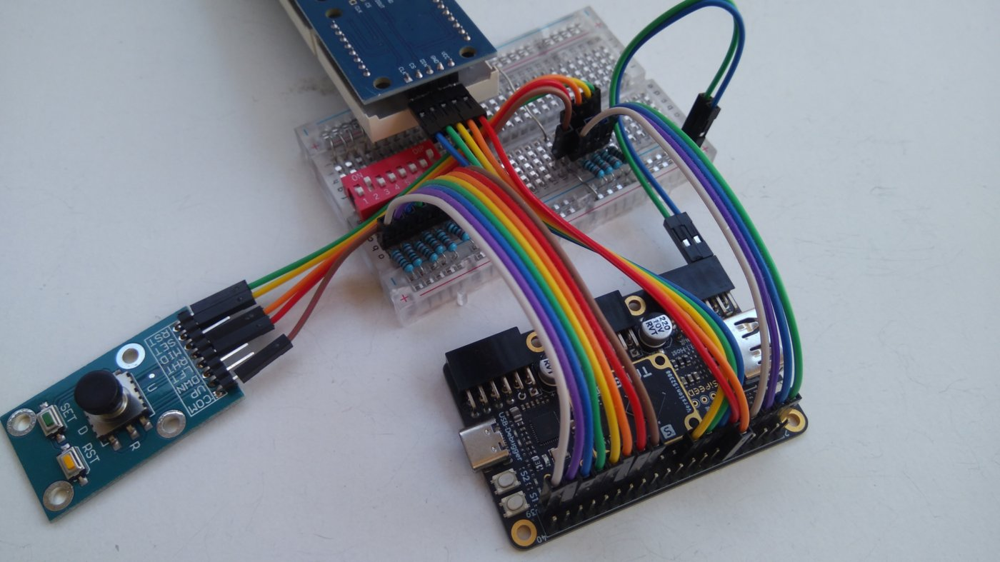

### Instructions for setting up the Tang Primer 25K FPGA with the E80 Toolchain

1. Install Gowin EDA Student Edition ([Windows](https://cdn.gowinsemi.com.cn/Gowin_V1.9.11.03_Education_x64_win.zip), [Linux](https://cdn.gowinsemi.com.cn/Gowin_V1.9.11.03_Education_Linux.tar.gz), [MacOS](https://cdn.gowinsemi.com.cn/Gowin_V1.9.11.03Education_macOS.dmg)).
2. Install the [latest version of the toolchain](https://github.com/Stokpan/E80/releases) and navigate to its folder.
3. Open `Boards\Gowin_TangPrimer25K\E80.cst` in a text editor and connect the components according to the Pin Assignments section.
    
    
   _Pin #11 of the top 2x20 vertical header provides 5V output, matching the requirements of the 4x8x8 LED module._
4. Open the `Boards\Gowin_TangPrimer25K\Gowin.gprj` project file in Gowin.
5. Compile the project using Run All and connect your Tang Primer 25K board to your PC.
6. When the compilation is finished use the Programmer function (click on USB Cable Setting > Save, and then click on Program/Configure) to upload the bitstream. You may need to click multiple times on Program/Configure.
7. The precompiled `hello` program will start running until the Halt flag is set (matrix 1, row 7, LED 5 from the left).