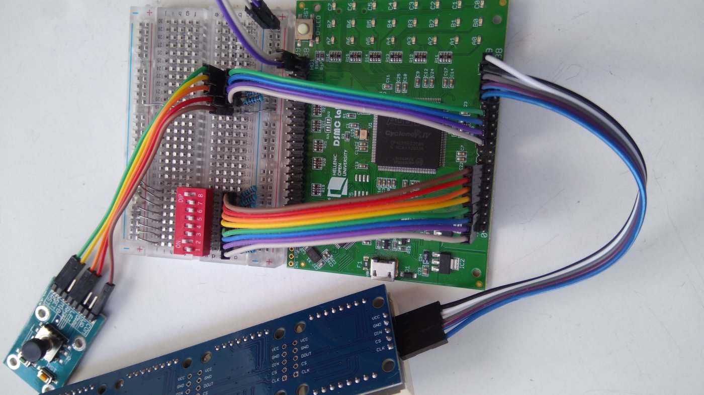

### Instructions for setting up the HOU DSD-i1 FPGA with the E80 Toolchain

1. Install [Quartus Prime Lite](https://www.altera.com/downloads/fpga-development-tools/quartus-prime-lite-edition-design-software-version-20-1-1-windows) and the DSD-i1 driver and X2Loader according to the Hellenic Open University's DSMC Lab instructions.
2. Install the [latest version of the toolchain](https://github.com/Stokpan/E80/releases) and navigate to its folder.
3. Open `Boards\Quartus_DSDi1\E80.qsf` in a text editor and connect the components according to the Pin Assignments section.
    
    
   _The LED module requires a 5V VCC input at 330mA. For my testing purposes, I connected it to the 3.3V VDD pin #37 in the HD2 bank, but it's best to use a dedicated supply instead._
4. Open the `Boards\Quartus_DSDi1\E80.qpf` project file in Quartus.
5. Hit Ctrl-L to start compilation.
6. When the compilation is finished start X2Loader and check out its COM ports. Connect the board, then close and reopen X2Loader. Notice there's a new COM port. Select this one, click Connect, and then Upload Bitstream. Select the RBF file from the `Boards\Quartus_DSDi1\output_files` folder.
7. The precompiled `hello` program will start running until the Halt flag is set (matrix 1, row 7, LED 5 from the left).