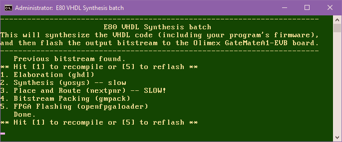

### Instructions for setting up the GateMateA1-EVB FPGA with the E80 Toolchain

The following assume that you have installed the [latest version of the toolchain](https://github.com/Stokpan/E80/releases).

1. Download the [OSS CAD Suite for Windows](https://github.com/YosysHQ/oss-cad-suite-build/releases) and run it from the main toolchain folder; it will extract its oss-cad-suite folder there.
2. Connect the GateMate board to your computer via USB, locate the new DirtyJtag device on the Device Manager, and update it to the Driver folder in the same location with this Readme. The device should now appear under Universal Serial Bus devices (not the standard USB adapters).
3. Open E80.ccf in a text editor and connect the components according to the Pin Assignments section.
   
   
   _The LED module requires a 5V VCC input at 330mA. For my testing purposes, I connected it to the 2.5V VDD pin #1 in BANK_NB1 for several hours without issues aside from lower brightness._
4. Run synth.bat. It will go through all the necessary steps, from checking requirements to flashing:
   
5. The LED Matrix test will start running indefinitely.