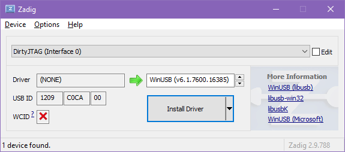
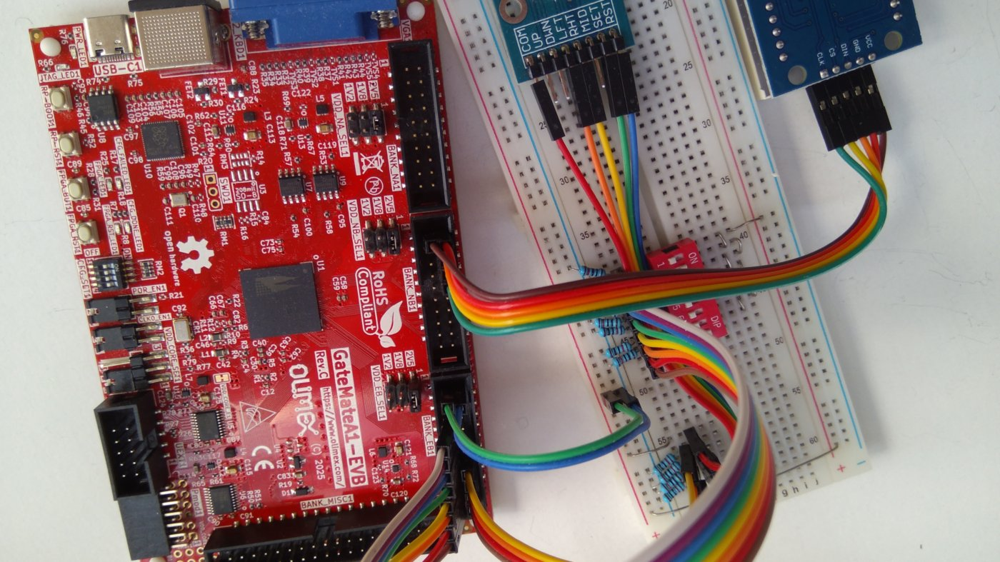

### Instructions for setting up the GateMateA1-EVB FPGA with the E80 Toolchain

1. Install the [latest version of the toolchain](https://github.com/Stokpan/E80/releases) and navigate to its folder.
2. Download the [OSS CAD Suite for Windows](https://github.com/YosysHQ/oss-cad-suite-build/releases) and run it on the toolchain folder; it will extract its oss-cad-suite folder there.
3. To install the USB driver for the board, connect it to your computer and download and run [Zadig](https://zadig.akeo.ie/). Make sure you see the same with this screenshot:
	 
	 Click Install Driver and wait until Zadig reports that "the driver was installed successfully".
4. Open `Boards\Yosys_GateMateA1\E80.ccf` in a text editor and connect the components according to the Pin Assignments section.
    
    
   _The LED module requires a 5V VCC input at 330mA. For my testing purposes, I connected it to the 2.5V VDD pin #1 in BANK_NB1, but it's best to use a dedicated supply instead._
5. Run the _GateMate Synthesis Batch_ from the E80 Toolchain folder on the Start Menu and wait until all steps, from elaboration to flashing, are finished:
    
6. The precompiled `hello` program will start running until the Halt flag is set (matrix 1, row 7, LED 5 from the left).