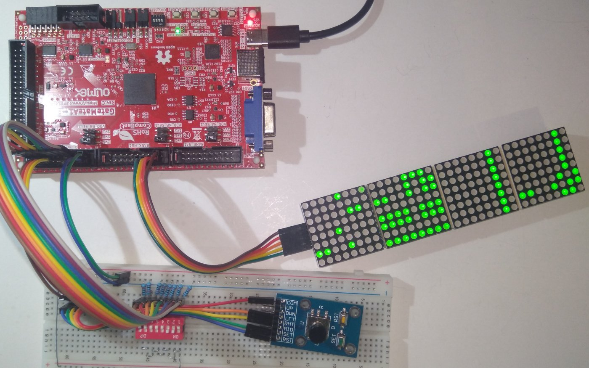

1. Download the [OSS CAD Suite for Windows](https://github.com/YosysHQ/oss-cad-suite-build/releases) and run it from the main toolchain directory so that it extracts an oss-cad-suite directory there.
2. Connect your GateMate board to your computer via USB, locate the new DirtyJtag device on the Device Manager, and update it to the Driver folder in the same location with this Readme. The device should now appear under Universal Serial Bus devices (not the standard USB adapters).
3. Open E80.ccf in a text editor and connect the components according to the Pin Assignments section and these images:  
4. Run synth.bat. It will go through all the necessary steps, from checking requirements to flashing.
5. The LED Matrix test will start running.