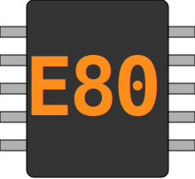
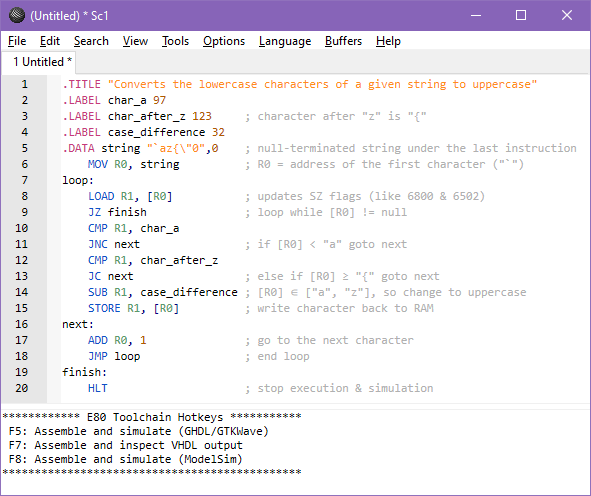
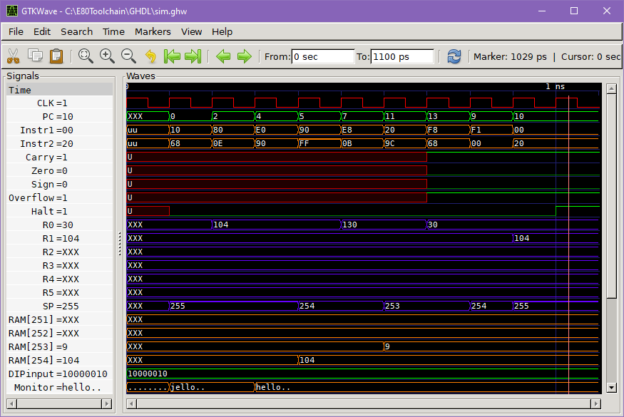
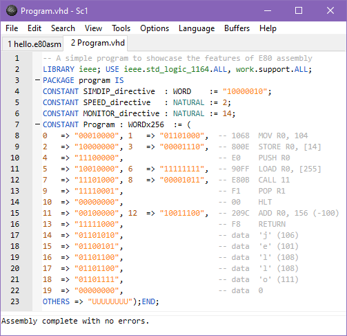
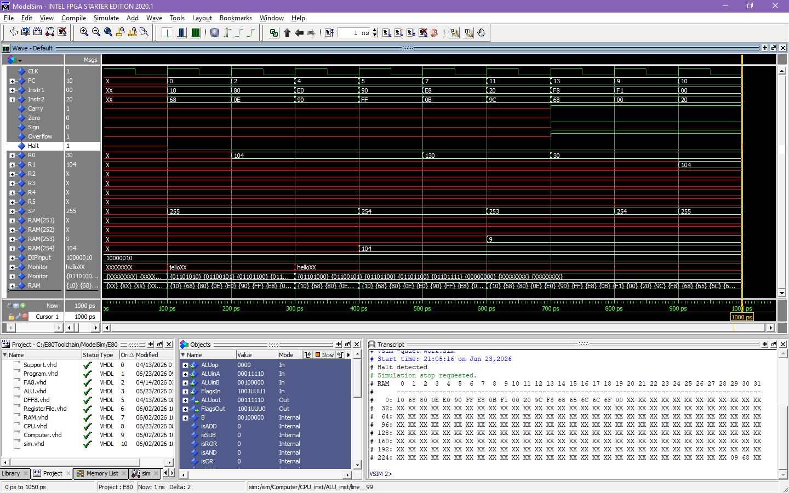
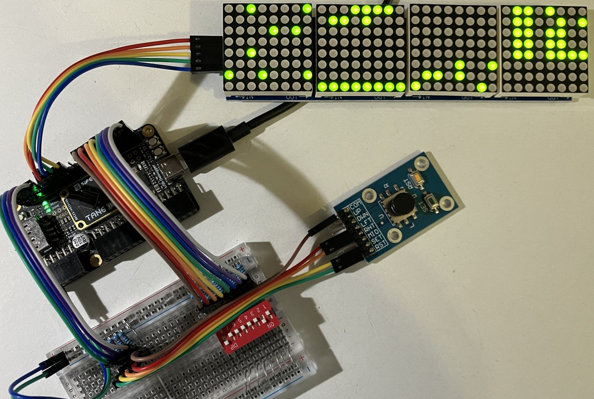
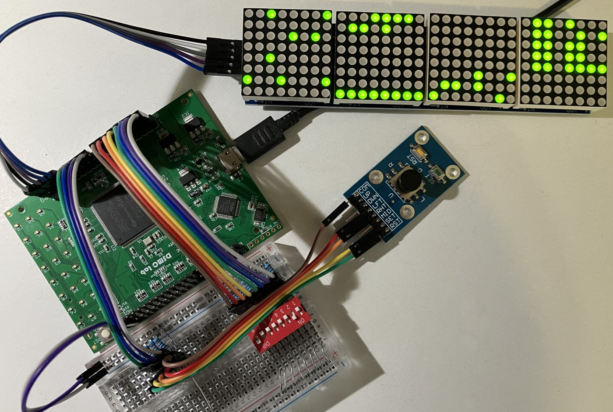
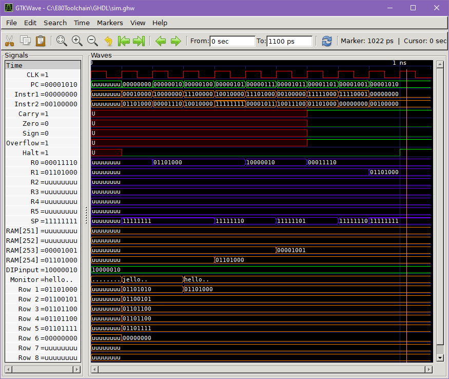
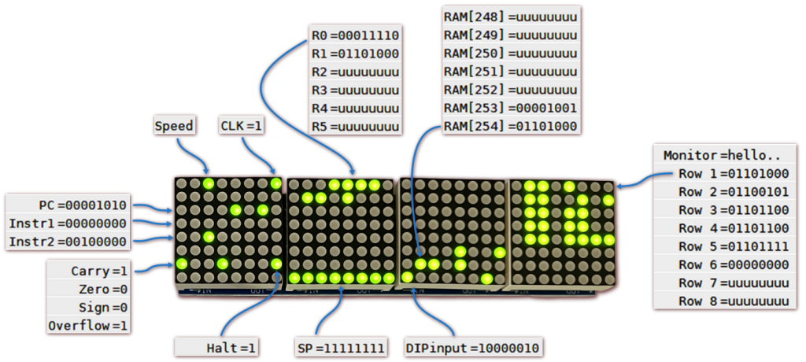

<a href="#"></a> is a simple von Neumann computer originally developed for [my undergraduate thesis](https://apothesis.eap.gr/archive/item/222454) as a Papertian Microworld. A toolchain for one-click assembly and simulation serves as a low floor, a textbook-complete instruction set provides the high ceiling, and a pre-configured hardware interface for three low-cost FPGA boards sets the wide walls. Where classic microworlds treat their _Object‑to‑think‑with_ as a black box, the E80 CPU is built with structural VHDL and flip‑flops, using `ieee.std_logic_1164` only. This allows a student versed in elementary digital logic to understand and modify the _Object_ itself.

The implementation's engineering and methodology was [presented](https://doi.org/10.13140/RG.2.2.27849.71521) at [PACET 2026](https://sites.google.com/g.upatras.gr/pacet2026) and the paper is [available on IEEE Xplore](https://doi.org/10.1109/PACET68758.2026.11498245).<br clear="left">

## Table of Contents

1. [Features](#features)
2. [Instruction Set Architecture](#instruction-set-architecture)
3. [Assembly Language](#assembly-language)
4. [Simulation Example](#simulation-example)
5. [Hardware Implementation](#hardware-implementation)
6. [Workflow Example](#workflow-example)

## Features

* **Architecture**: 8-bit, single-cycle, Load/Store
* **Instruction format**: Variable size (1 or 2 words), up to 2 operands
* **Addressing**: Immediate, direct, register, register-indirect
* **Registers**: 6 general-purpose (R0-R5), flags (R6), stack pointer (R7)
* **Flags**: Carry, Zero, Sign, Overflow, Halt
* **Memory**: Multiport to support single cycle access, addressable at 0x00-0xFE
* **Stack**: Full-descending, stack pointer initialized at 0xFF
* **Input**: 8‑bit DIP switches, memory‑mapped at 0xFF
* **Output**: Serial 4x8x8 LED Matrix (4 daisy-chained MAX7219)
* **Assembly syntax**: Hybrid of ARM, x86, and textbook pseudocode
* **Assembler**: Written in ISO C99, using stdin/stdout/stderr only
* **Simulated on**: GHDL+GTKWave and ModelSim
* **Tested on**: GateMateA1-EVB (OSS CAD Suite), Tang Primer 25K (Gowin), DSD-i1 Cyclone IV (Quartus)

## Instruction Set Architecture

```
Operands : n = 8-bit immediate value or direct memory address
           r, r1, r2 = 3-bit register address (R0 to R7)
           eg. MOV R5,110 = 00010rrr nnnnnnnn = 00010101 01101110 = 1rnn = 156E
[x]      : Memory at address x < 255, [255] = DIP input
PC       : Program counter, initialized to 0 on reset
SP       : Register R7, initialized to 255 on reset
           --SP Decrease SP by 1, and then read it
           SP++ Read SP, and then increase it by 1
Flags    : Register R6 = [CZSVH---] (see ALU.vhd)
           C = Carry out (unsigned arithmetic) or shifted-out bit
           Z = Zero, set to 1 when result is 0
           S = Sign, set to the most significant bit of the result
           V = Overflow (signed arithmetic), or sign bit flip in L/RSHIFT
           H = Halt flag, (freezes PC)

     +-------------------+-------+---------------+-----------------------+-------+
     | Instruction       | Hex   | Mnemonic      | Description           | Flags |
+----+-------------------+-------+---------------+-----------------------+-------+
| 1  | 00000000          | 00    | HLT           | PC ← PC               |     H |
| 2  | 00000001          | 01    | NOP           |                       |       |
| 3  | 00000010 nnnnnnnn | 02 nn | JMP n         | PC ← n                |       |
| 4  | 00000100 nnnnnnnn | 04 nn | JC n          | if C=1, PC ← n        |       |
| 5  | 00000101 nnnnnnnn | 05 nn | JNC n         | if C=0, PC ← n        |       |
| 6  | 00000110 nnnnnnnn | 06 nn | JZ n          | if Z=1, PC ← n        |       |
| 7  | 00000111 nnnnnnnn | 07 nn | JNZ n         | if Z=0, PC ← n        |       |
| 8  | 00001010 nnnnnnnn | 0A nn | JS n          | if S=1, PC ← n        |       |
| 9  | 00001011 nnnnnnnn | 0B nn | JNS n         | if S=0, PC ← n        |       |
| 10 | 00001100 nnnnnnnn | 0C nn | JV n          | if V=1, PC ← n        |       |
| 11 | 00001101 nnnnnnnn | 0D nn | JNV n         | if V=0, PC ← n        |       |
| 12 | 00001110 nnnnnnnn | 0E nn | CALL n        | PC+2 → [--SP]; PC ← n |       |
| 13 | 00001111          | 0F    | RETURN        | PC ← [SP++]           |       |
| 14 | 00010rrr nnnnnnnn | 1r nn | MOV r,n       | r ← n                 |  ZS   |
| 15 | 00011000 0rrr0rrr | 18 rr | MOV r1,r2     | r1 ← r2               |  ZS   |
| 16 | 00100rrr nnnnnnnn | 2r nn | ADD r,n       | r ← r+n               | CZSV  |
| 17 | 00101000 0rrr0rrr | 28 rr | ADD r1,r2     | r1 ← r1+r2            | CZSV  |
| 18 | 00110rrr nnnnnnnn | 3r nn | SUB r,n       | r ← r+(~n)+1          | CZSV  |
| 19 | 00111000 0rrr0rrr | 38 rr | SUB r1,r2     | r1 ← r1+(~r2)+1       | CZSV  |
| 20 | 01000rrr nnnnnnnn | 4r nn | AND r,n       | r ← r&n               |  ZS   |
| 21 | 01001000 0rrr0rrr | 48 rr | AND r1,r2     | r1 ← r1&r2            |  ZS   |
| 22 | 01010rrr nnnnnnnn | 5r nn | OR r,n        | r ← r|n               |  ZS   |
| 23 | 01011000 0rrr0rrr | 58 rr | OR r1,r2      | r1 ← r1|r2            |  ZS   |
| 24 | 01100rrr nnnnnnnn | 6r nn | XOR r,n       | r ← r^n               |  ZS   |
| 25 | 01101000 0rrr0rrr | 68 rr | XOR r1,r2     | r1 ← r1^r2            |  ZS   |
| 26 | 01110rrr nnnnnnnn | 7r nn | ROR r,n       | r>>n (r<<8-n)         |  ZS   |
| 27 | 01111000 0rrr0rrr | 78 rr | ROR r1,r2     | r1>>r2 (r1<<8-r2)     |  ZS   |
| 28 | 10000rrr nnnnnnnn | 8r nn | STORE r,[n]   | r → [n]               |       |
| 29 | 10001000 0rrr0rrr | 88 rr | STORE r1,[r2] | r1 → [r2]             |       |
| 30 | 10010rrr nnnnnnnn | 9r nn | LOAD r,[n]    | r ← [n]               |  ZS   |
| 31 | 10011000 0rrr0rrr | 98 rr | LOAD r1,[r2]  | r1 ← [r2]             |  ZS   |
| 32 | 10100rrr          | Ar    | LSHIFT r      | (C,r)<<1; V ← S flip  | CZSV  |
| 33 | 10110rrr nnnnnnnn | Br nn | CMP r,n       | SUB, discard result   | CZSV  |
| 34 | 10111000 0rrr0rrr | B8 rr | CMP r1,r2     | SUB, discard result   | CZSV  |
| 35 | 11000rrr nnnnnnnn | Cr nn | BIT r,n       | AND, discard result   |  ZS   |
| 36 | 11001000 0rrr0rrr | C8 rr | BIT r1,r2     | AND, discard result   |  ZS   |
| 37 | 11010rrr          | Dr    | RSHIFT r      | (r,C)>>1; V ← S flip  | CZSV  |
| 38 | 11100rrr          | Er    | PUSH r        | r → [--SP]            |       |
| 39 | 11110rrr          | Fr    | POP r         | r ← [SP++]            |       |
+----+-------------------+-------+---------------+-----------------------+-------+
```
**Notes**
* `ROR R1,R2` rotates R1 to the right by R2 bits. This is equivalent to left rotation by 8-R2 bits.
* Carry and Overflow flags are updated by arithmetic and shift instructions, except `ROR`.
* Shift instructions are logical; Carry flag = shifted bit and the Overflow flag is set if the sign bit is changed.
* Sign and Zero flags are updated by `CMP`, `BIT`, and any instruction that modifies a register, except for stack-related instructions.
* The `HLT` instruction sets the Halt flag and freezes the PC, thereby stopping execution in the current cycle.
* Explicit modification of the FLAGS register takes precedence over normal flag changes, eg. `OR FLAGS, 0b01000000` sets Z=1 although the result is non-zero.
* Addition & subtraction is performed with a textbook adder; flags are set according to this cheatsheet:
```
	               +------+-----------------------------+----------------------+
	               | Flag | Signed                      | Unsigned             |
	+--------------+------+-----------------------------+----------------------+
	| ADD a,b      | C=1  |                             | a+b > 255 (overflow) |
	|              | C=0  |                             | a+b ≤ 255            |
	|              | V=1  | a+b ∉ [-128,127] (overflow) |                      |
	|              | V=0  | a+b ∈ [-128,127]            |                      |
	|              | S=1  | a+b < 0                     | a+b ≥ 128 (if C=0)   |
	|              | S=0  | a+b ≥ 0                     | a+b < 128 (if C=0)   |
	+--------------+------+-----------------------------+----------------------+
	| SUB/CMP a,b  | C=1  |                             | a ≥ b                |
	|              | C=0  |                             | a < b (overflow)     |
	|              | V=1  | a-b ∉ [-128,127] (overflow) |                      |
	|              | V=0  | a-b ∈ [-128,127]            |                      |
	|              | S=1  | a < b (if V=0)              | a-b ≥ 128 (if C=1)   |
	|              | S=0  | a ≥ b (if V=0)              | a-b < 128 (if C=1)   |
	+--------------+------+-----------------------------+----------------------+
```

## Assembly Language

```
string : ASCII with escaped quotes, eg. "a\"bc" is quoted a"bc
label  : Starts from a letter, may contain letters, numbers, underscores
number : -128 to 255 no leading zeros, or bin (eg. 0b0011), or hex (eg. 0x0A)
val    : Number or label
csv    : Comma-separated numbers and strings
reg    : Register R0-R7 or FLAGS (alias of R6) or SP (alias of R7)
op2    : Reg or val (flexible 2nd operand)
[op2]  : Memory at address op2 (or DIP input if op2=0xFF)

+----------------------+----------------------------------------------------+
| Directive            | Description                                        |
+----------------------+----------------------------------------------------+
| .TITLE "string"      | Set the title for the Program.vhd output           |
| .LABEL label number  | Assign a number to a label                         |
| .DATA label csv      | Append csv at label address after program space    |
| .SIMDIP value        | Set the DIP switch input (simulation only)         |
| .SPEED level         | Initialize clock speed to level 0-6 on the FPGA    |
| .MONITOR value       | Address of 8-word RAM block to be displayed        |
+----------------------+----------------------------------------------------+

+----------------------+----------------------------------------------------+
| Instruction          | Description                                        |
+----------------------+----------------------------------------------------+
| label:               | Label the address of the next instruction          |
| HLT                  | Set the H flag and halt execution                  |
| NOP                  | No operation                                       |
| JMP n                | Jump to address n                                  |
| Jflag n              | Jump if flag=1 (flags: C,Z,S,V)                    |
| JNflag n             | Jump if flag=0                                     |
| CALL n               | Call subroutine at n                               |
| RETURN               | Return from subroutine                             |
| MOV reg, op2         | Move op2 to reg                                    |
| ADD reg, op2         | Add op2 to reg                                     |
| SUB reg, op2         | Subtract op2 from reg (add 2's complement of op2)  |
| ROR reg, op2         | Rotate right by op2 bits (left by 8-op2 bits)      |
| AND reg, op2         | Bitwise AND                                        |
| OR reg, op2          | Bitwise OR                                         |
| XOR reg, op2         | Bitwise XOR                                        |
| STORE reg, [op2]     | Store reg to op2 address, reg → [op2]              |
| LOAD reg, [op2]      | Load reg with word at op2 address, reg ← [op2]     |
| RSHIFT reg           | Right shift, C = shifted bit, V = sign change      |
| CMP reg, op2         | Compare with SUB, set flags and discard result     |
| LSHIFT reg           | Left shift, C = shifted bit, V = sign change       |
| BIT reg, op2         | Bit test with AND, set flags and discard result    |
| PUSH reg             | Push reg to stack                                  |
| POP reg              | Pop reg from stack                                 |
+----------------------+----------------------------------------------------+
```
**Notes**
* Directives must precede instructions.
* Labels are case sensitive; directives and instructions are not.
* `.DATA` sets a label after the last instruction and writes the csv data to it; consecutive `.DATA` directives append after each other.
* Comments start with a semicolon.
* The `.SPEED` directive sets the initial CPU clock frequency in the FPGA according to the [Hardware Implementation section](#hardware-implementation). Default value is 2 (~1 Hz).
* The `.MONITOR` directive points to an 8-word block to display on the LED matrix, or as separate signals in ASCII and binary format in simulation; it defaults to 0.
* The `.SIMDIP` directive sets a constant value (default 0x00) for address 0xFF in simulation only. It's ignored on hardware execution, where 0xFF maps to the 8-bit DIP switches.

## Simulation Example

The following program sets a simulated input to address 0xFF through the SIMDIP directive, writes the null-terminated string _jello_ after the last instruction through the DATA directive, and marks the address of the string for display through the MONITOR directive. It then runs a few textbook assembly instructions.

```
.TITLE "A simple program to showcase the features of E80 assembly"
.SIMDIP 0b10000010      ; simulated DIP switch
.DATA string "jello",0  ; null-terminated
.MONITOR string         ; display 8-word block at string address
    MOV R0, 104         ; ASCII code of h
    STORE R0, [string]  ; replace j with h
    PUSH R0
    LOAD R0, [0xFF]     ; read DIP input address
    CALL subroutine
    POP R1
    HLT
subroutine:
    ADD R0, -100
    RETURN
```

To simulate it, first install the latest E80 Toolchain release, and then open the E80 Editor and paste the code into it:

<p align="center"></p>

_Notice that syntax highlighting for the E80 assembly language has been enabled by default._

Hit F5. The editor will automatically assemble the code into a VHDL-based format, run the entire design with GHDL, and launch GTKWave to view the waveforms. The Monitor signal on the bottom shows the .MONITOR directive's 8-word block as an ASCII string.

<p align="center"></p>

_Notice that the HLT instruction has stopped the simulation in GHDL, allowing for the waveforms to be drawn for the runtime only. This useful feature is supported in ModelSim as well._

You can make changes in the assembly source, and press F5 again; the previous GTKWave window will be automatically closed and replaced by the new one.

You can also hit F7 to view the generated Program.vhd file, without simulation:

<p align="center"></p>

_Notice how the assembler formats the output into columns according to instruction size, and annotates each line to its respective disassembled instruction, ASCII character or number._

Finally, you can press F8 to simulate in ModelSim. Unlike GHDL, ModelSim cannot be included in the toolchain, but it's currently free to [download](https://www.altera.com/downloads/simulation-tools/modelsim-fpgas-standard-edition-software-version-20-1-1). If you have enabled the E80 Layout for ModelSim on the toolchain installation, enable it from the corresponding Layout menu to get the following view:

<p align="center"></p>

_Pressing F8 again will update the simulation on the current ModelSim window._

## Hardware Implementation

Step-by-step instructions and settings are provided for the following boards (and EDAs):

| <a href="Boards/Gowin_TangPrimer25K/README.md">Tang Primer 25K (Gowin) <br> </a> | <a href="Boards/Yosys_GateMateA1/README.md">GateMateA1 (OSS CAD Suite) <br> </a> | <a href="Boards/Quartus_DSDi1/README.md">HOU DSD-i1 (Quartus) <br> </a> |
|---|---|---|

_The photos showcase the completed execution of hello.e80asm; Quartus and Gowin initialize undefined spaces to zero but Yosys does not. This is a desirable trait for the educational purposes of this project._

The design is complemented by an Interface unit which requires a clock input with its frequency (2 MHz minimum) specified in `Boards\*\Board.vhd`. This generates an array of clocks from 0 to 4 kHz, one of which is selected by the user to drive the CPU.

User input is provided by an 8-bit DIP switch. Reset, pause, and speed throttling are provided by four buttons; a 5-way joystick provides more than enough buttons. All input pins must be active-high with 10kΩ pull-down resistors.

Output is provided by a 4x8x8 LED module driven by four daisy-chained MAX7219 chips, requiring three input lines. The logic assumes the module is oriented with its pins on the left, where Matrix 1 is the leftmost and Row 1 is the topmost.

* **8-bit DIP switch:** Provides a static input word at address 0xFF.
* **Left/Right buttons:** Adjust speed level (clock frequency) as follows:
	* Speed level 0: 0 Hz, clock is gated high
	* Speed level 1: 0.24 Hz
	* Speed level 2: ~1 Hz
	* Speed level 3: ~2 Hz
	* Speed level 4: ~4 Hz
	* Speed level 5: ~15 Hz
	* Speed level 6: 4 KHz
* **Pause button:** Gates clock to low while pressed. When speed level is set to 0, releasing pause will trigger a rising edge thereby allowing for step execution.
* **Reset button:** Re-uploads Program.vhd to the RAM, resets the Program Counter to 0 and the Stack Pointer to 255, and clears the Halt flag.
* **Matrix 1:**
	* Row 1: **Speed level** (one-hot encoded on first seven LEDs), **Clock** (rightmost LED)
	* Row 2: blank
	* Row 3: **Program Counter**
	* Row 4: **Instr1** (Instruction Word part 1)
	* Row 5: **Instr2** (Instruction Word part 2)
	* Row 6: blank
	* Row 7: **Carry**, **Zero**, **Sign**, **Overflow**, **Halt**
	* Row 8: blank
* **Matrix 2:**
	* Rows 1-6: **General Purpose Registers R0-R5**
	* Row 7: blank
	* Row 8: **Stack Pointer (R7)**
* **Matrix 3:**
	* Rows 1-7: **Stack Space** (RAM block 248-254)
	* Row 8: **DIP switch input**
* **Matrix 4:**
	* Rows 1-8: **.MONITOR Block** (8-word RAM block starting from the .MONITOR's address)

## Workflow Example

The following assumes that you have set an FPGA board according to the instructions in the previous section.

Start the E80 Editor, open `hello.e80asm` and hit F5 to assemble and simulate it. Resize the GTKWave window to reveal the Monitor Rows at the bottom. Select all signals except the Monitor string, and set them to Binary as seen here:

<p align="center"></p>

Follow the board-specific instructions from the previous section to compile the project on your EDA and run it on your hardware. Your assembled program will run with the default speed util the Halt flag turns on (leftmost row #7, LED #5).

To restart with step execution, set speed to 0 and then press Reset. Use the Pause button to execute step-by-step while comparing the LED display with the simulated results on GTKWave:

<p align="center"></p>